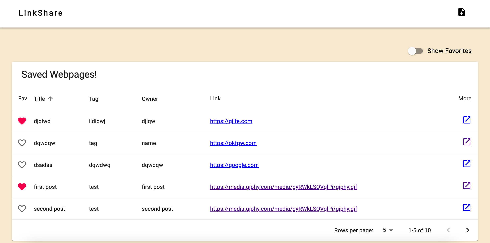
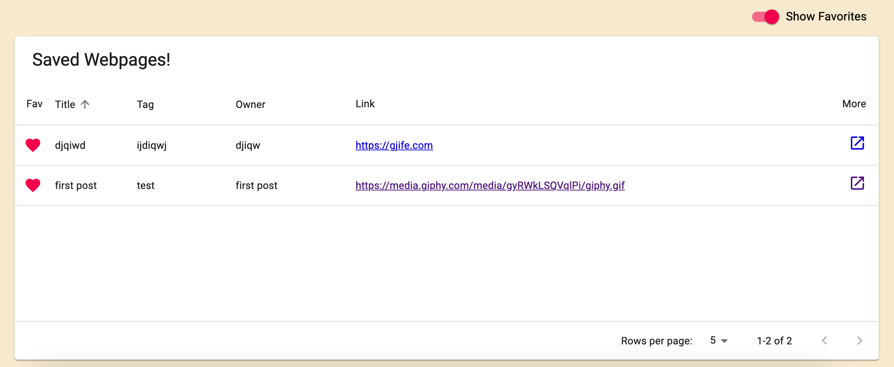
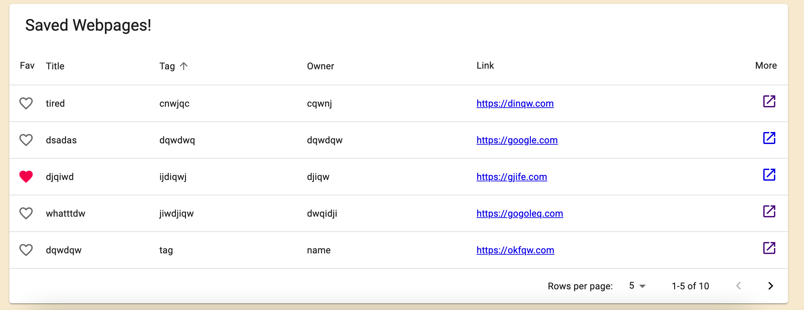
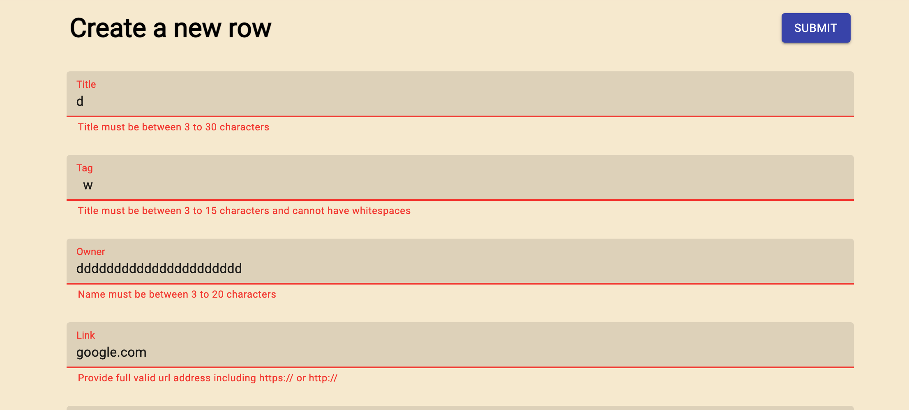

# Lab 4: Platform Client

*Lab for creating a front-end platform that uses redux and api calls. Instead of using coverUrl as images in blog format, I decided to use table format to display info that saves url a user is interested in. While it may sound similar to bookmarking, this platform allows users to take notes of the webpage and share it with other users.*

[deployed url](http://url-if-deployed-here)

## What Worked Well
* Material-ui: great package with examples and descriptions. Some concepts were hard to fully understand in a short time such as styling etc.. Used examples from their webpage as part of my code. (DataTable)

## What Didn't
* Redux is hard! Took a while to understand how redux works, but still complicated. I had hard time finding a way to save redux state to local state. Used callback inside action as solution.

## Extra Credit
* Table format that displays title, tag, owner(person who wrote the text), url link.

* Can select favorites by clicking heart and filter by only showing favorites. Not local change, but change in the server.

* Sorting by name, tags, and owner

* Input validation. Won't allow submit without passing validation

## Screenshots
